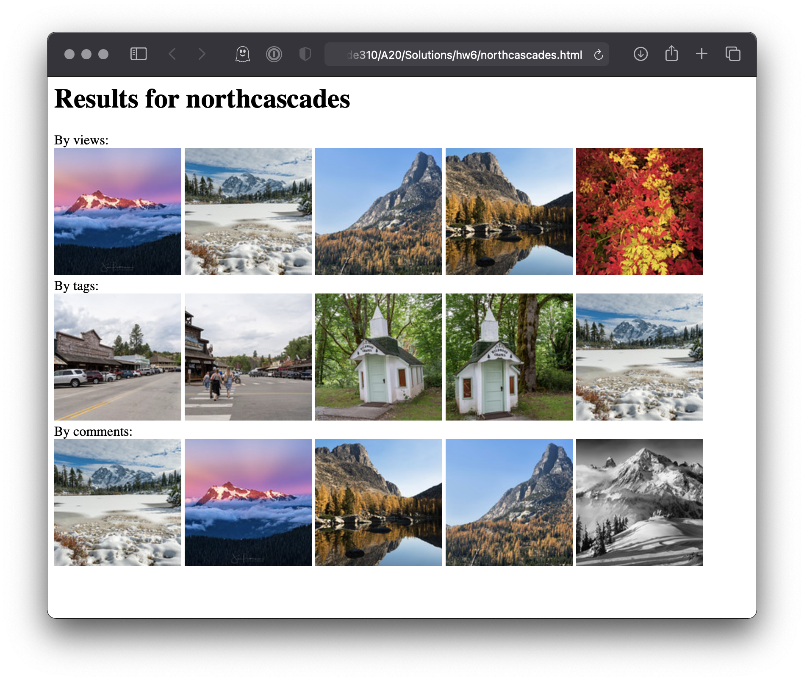

[](https://classroom.github.com/online_ide?assignment_repo_id=3650177&assignment_repo_type=AssignmentRepo)
# Homework 6 - Sorting and Filtering Lists

What to hand in:
*	hw6.py: your Flickr app
*	Include the HTML page, flickrimages.html, you generate 

# Part 1: Exercises. Ungraded
For practice with list comprehensions, filtering, and sorting, please review the exercises in the `ClassCode/S12` folder.

# Part 2: Flickr App. Graded
In this assignment, you will search for and process information about photos on Flickr. You will create three building blocks to search for Flickr photos and represent them as objects. In the main assignment, you will use these building blocks to search for a tag of your choosing, and sort the data in different ways. Finally, you will print out a list of the top users.

As with the last assignment, most of the instructions are located in the hw6.py file itself. The following provides additional background and screenshots.

## Flickr API_Key
You will need to get your own API key from Flickr.com. Follow the process illustrated in the slides for session 10. Save the key as the value assigned to the variable api_key in the file `flickr_key.py.`

## Building blocks
You will create three building blocks: (1) a function that uses the Flickr JSON API to search for photos with a certain tag, and returns a list of corresponding photo IDs; (2) a function that returns a dictionary containing information about a photo, using the Flickr API; (3) a class that represents a Photo.

The class gives you an easy way to access the title, author, tags, the URL to see the Photo on Flickr, and URL for images of varying sizes. For determining the thumbnail URL, you will find this documentation helpful: https://www.flickr.com/services/api/misc.urls.html 
Your class definition also will include an easy way to print out information about the photo.

See hw6.py for full instructions and code to test your building blocks. 

## Main Assignment
There are four parts:

### 1. Search for a tag
Use building blocks (1-3) to generate a list of photos corresponding to a search term (tag) of your choosing.

You can greatly improve the quality of your search results by experimenting with the sort parameter. See https://www.flickr.com/services/api/flickr.photos.search.html for details. 

### 2. Print top five
Print (a) information about the top five most viewed photos, (b) the top five most tagged photos, and (c) the top five commented photos.

### 3. Authors by top vews
Count the total number of views received by each author, including only the photos in your results. If a user 'Johnny 5' authored four photos, which had 100, 200, 700, and 221 views, the total for that user would be 1221.

Then, print the top ten most successful authors in terms of number of views, from most to least. If another user had many more photos, but fewer total views, they would go lower in the rankings.

### 4. HTML Output
Generate an HTML page containing image thumbnails from the top five viewed, tagged, and commented photos (from part 2). We encourage you to try Jinja to make this page, but you can also make it by building a large string (as you did in HW5 for your reactions page). 



You may find it helpful to know how to iterate over nested dictionaries in Jinja. There is an example in the appendix (below).
 
# Part 3: Extra Practice / Review, JFF, Optional & Ungraded
Write a program, possibly using your previous code (HW5), that will process the Slack data to:
*	Print the top 5 posters
*	Print the top 5 reaction-getters
*	Print the top 100 words, and a word count, that appear in the messages. Make sure you remove stopwords!
*	Repeat the previous for the comments. Are the lists different? How would you represent the differences?

# Appendix: Iterating over nested dictionaries in Jinja
Iterating over nested dictionaries in Jinja is non-obvious. If we have a dictionary like:
`pd = [{'A':'val1','B':'val2'},{'C':'val3','D':'val4'}]`

and we include it in our template values as:
`tvals['pd'] = pd`

Then in Jinja, we can access it as

```

   
      <h1>Key: {{key}}</h1>
      <h2>Value: {{value}}</h2>
   
 
```

# Appendix: Example output
I only had photos from seven posters in my results so my top ten authors by number of views became a top seven list.

```
Testing your building blocks
------------
['50580323236', '50578293693', '50574605801', '50573863093']
{'id': '5140736446', 'secret': 'cc2d58c2f4', 'server': '4021', 'farm': 5, 'dateuploaded': '1288726568', 'isfavorite': 0, 'license': '0', 'safety_level': '0', 'rotation': 0, 'owner': {'nsid': '89692371@N00', 'username': 'pyza*', 'realname': '', 'location': None, 'iconserver': '5450', 'iconfarm': 6, 'path_alias': 'chmurka'}, 'title': {'_content': 'Food makes me lose my Mind ~ Migotka.'}, 'description': {'_content': 'And lose her balance, too.'}, 'visibility': {'ispublic': 1, 'isfriend': 0, 'isfamily': 0}, 'dates': {'posted': '1288726568', 'taken': '2010-10-10 19:28:14', 'takengranularity': '0', 'takenunknown': 0, 'lastupdate': '1470202960'}, 'views': '12259', 'editability': {'cancomment': 0, 'canaddmeta': 0}, 'publiceditability': {'cancomment': 1, 'canaddmeta': 0}, 'usage': {'candownload': 0, 'canblog': 0, 'canprint': 0, 'canshare': 1}, 'comments': {'_content': '20'}, 'notes': {'note': []}, 'people': {'haspeople': 0}, 'tags': {'tag': [{'id': '5624345-5140736446-8618113', 'author': '89692371@N00', 'authorname': 'pyza*', 'raw': 'Migotka', '_content': 'migotka', 'machine_tag': 0}, {'id': '5624345-5140736446-10160', 'author': '89692371@N00', 'authorname': 'pyza*', 'raw': 'Mimi', '_content': 'mimi', 'machine_tag': 0}, {'id': '5624345-5140736446-9112', 'author': '89692371@N00', 'authorname': 'pyza*', 'raw': 'Mima', '_content': 'mima', 'machine_tag': 0}, {'id': '5624345-5140736446-16863', 'author': '89692371@N00', 'authorname': 'pyza*', 'raw': 'hamster', '_content': 'hamster', 'machine_tag': 0}, {'id': '5624345-5140736446-345921', 'author': '89692371@N00', 'authorname': 'pyza*', 'raw': 'hammie', '_content': 'hammie', 'machine_tag': 0}, {'id': '5624345-5140736446-6872352', 'author': '89692371@N00', 'authorname': 'pyza*', 'raw': 'chomik', '_content': 'chomik', 'machine_tag': 0}, {'id': '5624345-5140736446-127044', 'author': '89692371@N00', 'authorname': 'pyza*', 'raw': 'syrian', '_content': 'syrian', 'machine_tag': 0}, {'id': '5624345-5140736446-867', 'author': '89692371@N00', 'authorname': 'pyza*', 'raw': 'girl', '_content': 'girl', 'machine_tag': 0}, {'id': '5624345-5140736446-952', 'author': '89692371@N00', 'authorname': 'pyza*', 'raw': 'animal', '_content': 'animal', 'machine_tag': 0}, {'id': '5624345-5140736446-359', 'author': '89692371@N00', 'authorname': 'pyza*', 'raw': 'pet', '_content': 'pet', 'machine_tag': 0}, {'id': '5624345-5140736446-2197', 'author': '89692371@N00', 'authorname': 'pyza*', 'raw': 'rodent', '_content': 'rodent', 'machine_tag': 0}, {'id': '5624345-5140736446-5771', 'author': '89692371@N00', 'authorname': 'pyza*', 'raw': 'critter', '_content': 'critter', 'machine_tag': 0}, {'id': '5624345-5140736446-559', 'author': '89692371@N00', 'authorname': 'pyza*', 'raw': 'cute', '_content': 'cute', 'machine_tag': 0}, {'id': '5624345-5140736446-7664', 'author': '89692371@N00', 'authorname': 'pyza*', 'raw': 'adorable', '_content': 'adorable', 'machine_tag': 0}, {'id': '5624345-5140736446-5881', 'author': '89692371@N00', 'authorname': 'pyza*', 'raw': 'fat', '_content': 'fat', 'machine_tag': 0}, {'id': '5624345-5140736446-33363', 'author': '89692371@N00', 'authorname': 'pyza*', 'raw': 'chubby', '_content': 'chubby', 'machine_tag': 0}, {'id': '5624345-5140736446-2876', 'author': '89692371@N00', 'authorname': 'pyza*', 'raw': 'beige', '_content': 'beige', 'machine_tag': 0}, {'id': '5624345-5140736446-535', 'author': '89692371@N00', 'authorname': 'pyza*', 'raw': 'flower', '_content': 'flower', 'machine_tag': 0}, {'id': '5624345-5140736446-24773', 'author': '89692371@N00', 'authorname': 'pyza*', 'raw': 'colourful', '_content': 'colourful', 'machine_tag': 0}, {'id': '5624345-5140736446-42011', 'author': '89692371@N00', 'authorname': 'pyza*', 'raw': 'grumpy', '_content': 'grumpy', 'machine_tag': 0}]}, 'urls': {'url': [{'type': 'photopage', '_content': 'https://www.flickr.com/photos/chmurka/5140736446/'}]}, 'media': 'photo'}
~~~ Food makes me lose my Mind ~ Migotka. ~~~
author: pyza*
number of tags: 20
views: 12259
comments: 20
url: https://www.flickr.com/photos/chmurka/5140736446/
['migotka', 'mimi', 'mima', 'hamster', 'hammie', 'chomik', 'syrian', 'girl', 'animal', 'pet', 'rodent', 'critter', 'cute', 'adorable', 'fat', 'chubby', 'beige', 'flower', 'colourful', 'grumpy']

Top Five Photos by Views
------------
~~~ Mount Shuksan Rising ~~~
author: Jim Patterson Photography
number of tags: 24
views: 2280
comments: 14
url: https://www.flickr.com/photos/jimpatterson/50547056903/
~~~ Picture Lake Winter Scene, Mt. Shuksan, Washington ~~~
author: EdBob
number of tags: 39
views: 1653
comments: 98
url: https://www.flickr.com/photos/edbob/50538224591/
~~~ Looking back to Cathedral pass ~~~
author: D. Inscho
number of tags: 8
views: 669
comments: 7
url: https://www.flickr.com/photos/51168524@N04/50536971566/
~~~ The liturgy of autumn ~~~
author: D. Inscho
number of tags: 8
views: 558
comments: 7
url: https://www.flickr.com/photos/51168524@N04/50556043756/
~~~ Crimson and Gold ~~~
author: dwolters2
number of tags: 6
views: 343
comments: 1
url: https://www.flickr.com/photos/donwolterstorff/50546312111/

Top Five Photos by Number of Tags
------------
~~~ Winthrop, Washington - July 5, 2019: Street view of downtown Winthrop, a small wild west theme town in the Cascade Mountains of Washington State. ~~~
author: m01229
number of tags: 47
views: 274
comments: 0
url: https://www.flickr.com/photos/39908901@N06/50541369791/
~~~ Winthrop, Washington - July 5, 2019: Street view of downtown Winthrop, a small wild west theme town in the Cascade Mountains of Washington State. ~~~
author: m01229
number of tags: 47
views: 272
comments: 0
url: https://www.flickr.com/photos/39908901@N06/50541367121/
~~~ Marblemount, Washington - July 5, 2019: Tiny Wildwood Chapel, located in a small park along the North Cascades Highway ~~~
author: m01229
number of tags: 42
views: 142
comments: 0
url: https://www.flickr.com/photos/39908901@N06/50540665913/
~~~ Marblemount, Washington - July 5, 2019: Tiny Wildwood Chapel, located in a small park along the North Cascades Highway ~~~
author: m01229
number of tags: 42
views: 220
comments: 0
url: https://www.flickr.com/photos/39908901@N06/50540662793/
~~~ Picture Lake Winter Scene, Mt. Shuksan, Washington ~~~
author: EdBob
number of tags: 39
views: 1653
comments: 98
url: https://www.flickr.com/photos/edbob/50538224591/

Top Five Photos by Number of Comments
------------
~~~ Picture Lake Winter Scene, Mt. Shuksan, Washington ~~~
author: EdBob
number of tags: 39
views: 1653
comments: 98
url: https://www.flickr.com/photos/edbob/50538224591/
~~~ Mount Shuksan Rising ~~~
author: Jim Patterson Photography
number of tags: 24
views: 2280
comments: 14
url: https://www.flickr.com/photos/jimpatterson/50547056903/
~~~ The liturgy of autumn ~~~
author: D. Inscho
number of tags: 8
views: 558
comments: 7
url: https://www.flickr.com/photos/51168524@N04/50556043756/
~~~ Looking back to Cathedral pass ~~~
author: D. Inscho
number of tags: 8
views: 669
comments: 7
url: https://www.flickr.com/photos/51168524@N04/50536971566/
~~~ The border group ~~~
author: D. Inscho
number of tags: 9
views: 123
comments: 6
url: https://www.flickr.com/photos/51168524@N04/50585722457/

Top ten authors by number of views
------------
(1) D. Inscho: 5091
(2) Jim Patterson Photography: 2280
(3) EdBob: 1653
(4) m01229: 1436
(5) myfirstnameisharrison: 1278
(6) dwolters2: 343
(7) jgo_mo: 114
------------
```
